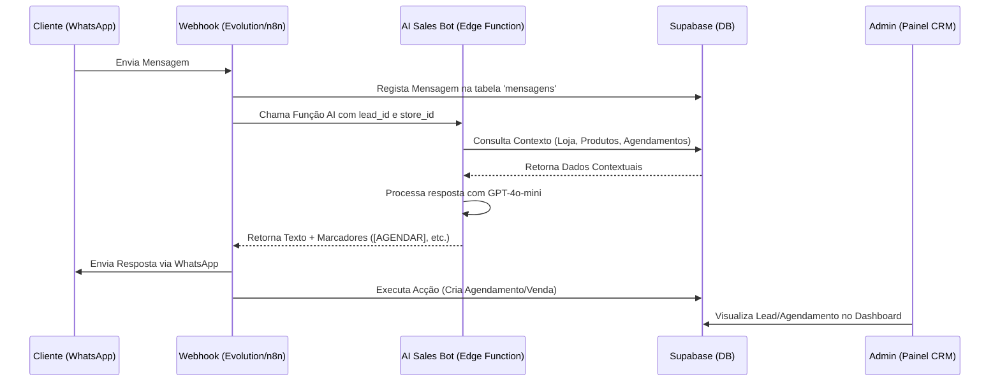

# Workflow do Sistema Zap Chat CRM

Este documento descreve o fluxo completo de operação do CRM, desde a recepção de uma mensagem até a conclusão de uma venda ou agendamento.

## 1. Visão Geral do Fluxo (High-Level)

O CRM opera integrando WhatsApp, Supabase (Banco de Dados e Auth) e OpenAI (Cérebro da IA).

## 2. A Lógica do Bot (IA)

O bot não é apenas um chat; ele é um **agente de vendas** configurável por loja.

### Personalidade Dinâmica
A IA adapta-se às configurações da tabela `lojas`:
*   **Tom de Voz**: `formal` (vossa excelência / o senhor) ou `descontraído` (tu / você).
*   **Idioma**: Suporte para `pt-AO` (Kwanza), `pt-PT` (Euro), `pt-BR` (Real), etc.
*   **Instruções da Loja**: O campo `linguagem_bot` no painel de configurações permite definir regras específicas (ex: "Sempre oferecer desconto de 5% se o cliente hesitar").

### Marcadores Técnicos (Action Tokens)
O bot comunica acções ao sistema através de marcadores em texto:
*   `[AGENDAR:servico|data_hora]`: Cria um novo agendamento.
*   `[CANCELAR_AGENDAMENTO]`: Remove agendamentos pendentes.
*   `[ENVIAR_PRODUTO:nome]`: Dispara o envio de foto e link de pagamento do produto.
*   `[ENVIAR_PAGAMENTO]`: Envia os dados de IBAN/Multicaixa configurados.
*   `[SAIR_BOT]`: Desactiva a IA para aquele lead e notifica o administrador para intervenção humana.

## 3. Gestão de Leads e Agendamentos

1.  **Captura de Leads**: Todo novo número que entra em contacto é registado automaticamente.
2.  **Qualificação**: O bot identifica o interesse (ex: "manicure", "comprar ténis") e actualiza o campo `interesse` no Supabase.
3.  **Agendamento Inteligente**:
    *   O bot consulta a agenda da loja antes de confirmar.
    *   Se o horário estiver ocupado, ele sugere alternativas baseadas nos slots livres dos próximos 3 dias.

## 4. Integração com Automações Externas (n8n)

Para fluxos complexos, o CRM expõe chaves de API que podem ser usadas no n8n:
*   **Trigger**: Webhook de nova venda ou novo agendamento.
*   **Acção**: Enviar e-mail de confirmação, actualizar Google Sheets ou disparar nota fiscal.

> [!TIP]
> Use as **API Keys** geradas no "Hub de Integrações" para autenticar chamadas externas de forma segura.

---
*Última Actualização: 30 de Março de 2026*
